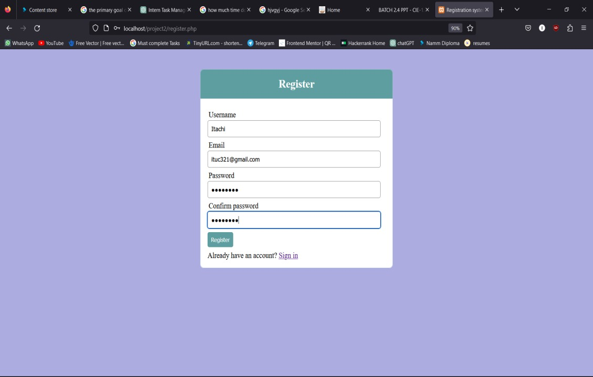
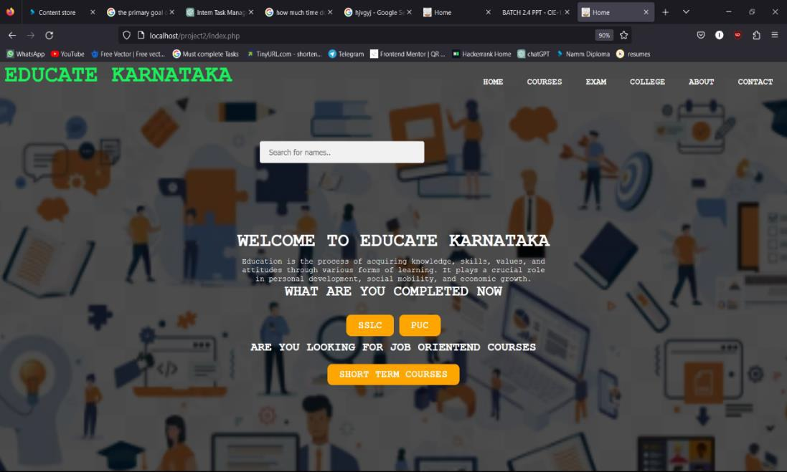
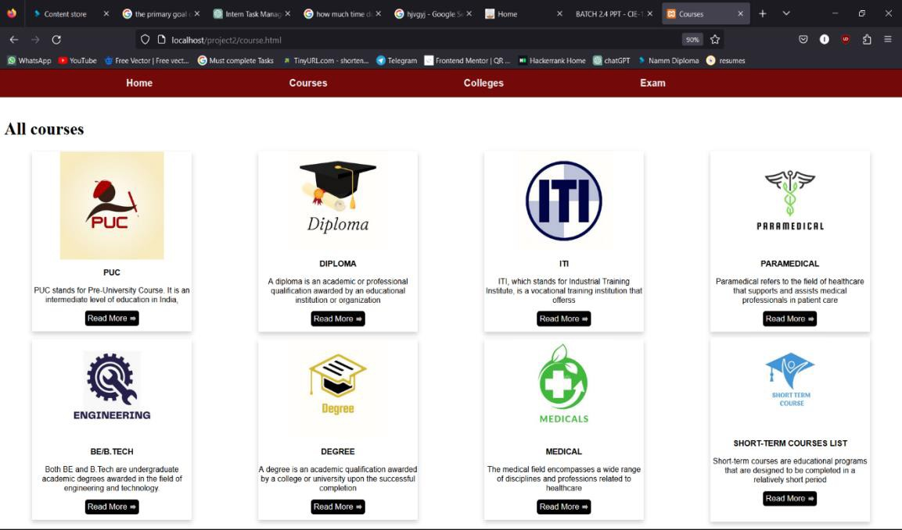

<h1 align="center">📚 Educate Karnataka</h1>
<h3 align="center">Full Stack Development Internship Project</h3>

  
  
  

---

## 📌 Project Overview
Educate Karnataka is a **Full Stack Development Internship Project** completed at **RunShaw Technologies**.  
The main objective of the project was to **design and develop a simple login system with database connectivity** while practicing **front-end development, GitHub collaboration, and version control**.  

This project allowed me to gain hands-on experience with **HTML, CSS, PHP, MySQL**, and project workflow in a real-world environment.

---

## 🏢 Company Profile (RunShaw Technologies)
- Leading IT Services company in **Mysore, Karnataka**  
- Expertise in **Web Development, Mobile Applications, Data Science**  
- Delivered **50+ apps** across multiple domains  
- Vision: *Build better brands through connected digital experiences*  
- Mission: *Deliver high-quality, customized software solutions with excellent client service*

---

## 🎯 Internship Objectives
- Apply **front-end development** concepts in real projects  
- Learn **database integration** using MySQL & PHP  
- Practice **version control** and teamwork through GitHub  
- Enhance **problem-solving and debugging skills**  
- Gain **professional communication and collaboration experience**

---

## 🛠️ Tech Stack Used
- **Frontend**: HTML, CSS  
- **Backend**: PHP  
- **Database**: MySQL  
- **Tools**: GitHub, VS Code  
- **Other**: Canva (UI Mockups), Figma (Prototyping)

---

## 🚀 Key Contributions
1. Designed **UI Pages** (Login, Signup, About, Contact, Course Pages)  
2. Developed **Login Page with Database Connectivity**  
3. Worked on **front-end development** and styling with HTML & CSS  
4. Implemented **Version Control with GitHub** for collaboration  
5. Conducted **Testing & Debugging** for functionality and design issues  

---

## 📊 Use Cases
### 🔹 Use Case 1: Front-End Development
- Developed UI for the web application using HTML, CSS, and JavaScript.  
- Ensured **responsive design** and **cross-browser compatibility**.  
- Regular code reviews and feedback sessions.  

### 🔹 Use Case 2: Login Page Development
- Created **Login Page** with username & password authentication.  
- Connected frontend with **MySQL database** using **PHP**.  
- Implemented **error handling & validation** for security.  

---

## 📸 Screenshots
| Register Page | UI Page | Course Page |
|------------|--------------|-------------|
|  |  |  |

---

## 📈 Strengths Gained
- ✔ Strong Communication Skills  
- ✔ Quick Learning & Adaptability  
- ✔ Team Collaboration  
- ✔ Problem-Solving & Debugging  
- ✔ Attention to Detail  

---

## 🔧 Areas for Improvement
- Time Management in projects  
- More **assertive communication** in team discussions  
- Explore advanced **backend frameworks** (Node.js, Django, etc.)  

---

## 📝 Executive Summary
This internship project gave me **real-world exposure** to software development practices.  
I learned **end-to-end development** – from UI design to backend database integration.  
The project helped me strengthen my **technical skills**, improve **team collaboration**, and prepare for **professional roles in software development**.  

---

## 👨‍💻 Author
**Gagan Gowda VS**  
🎓 Diploma in Computer Science & Engineering  
📧 Email: gagangowdavs321@gmail.com  

---

